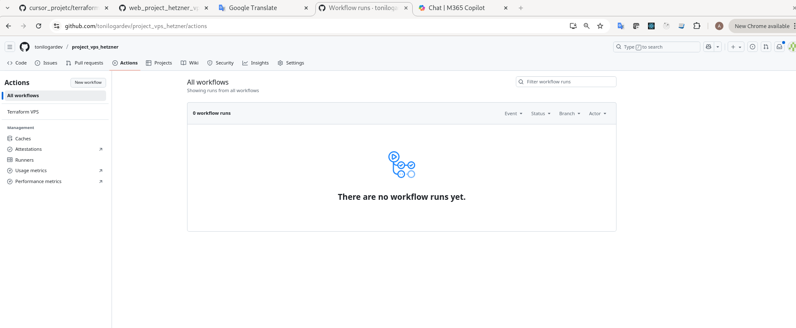

# Terraform

## Index

1. [Install Terraform CLI](#1-install-terraform-cli)   
2. [Environment variables](#2-environment-variables)
3. [GitHub Actions secrets](#3-github-actions-secrets)
4. [Code](#4-code)

---

## 1 Install Terraform CLI

Follow the official guide → <https://developer.hashicorp.com/terraform/tutorials/aws-get-started/install-cli>.  


[←Index](#index)

## 2 Environment variables

Terraform reads variables from [.env.development](../.env.development).  
Local workflow:

```bash
set -a && source .env.development && set +a
terraform init
terraform plan
```

`.env.development` only stores `TF_VAR_*` pairs and stays ignored by git; reuse the same structure for `.env.production` when needed.


### 3 GitHub Actions secrets

Store sensitive tokens in GitHub Secrets so the workflow can expose them to Terraform:

1. Settings → Secrets and variables → Actions → `New repository secret` (`HETZNER_CLOUD_TOKEN`, `HETZNER_DNS_TOKEN`).  
2. The manual workflow (`.github/workflows/terraform.yml`) maps those secrets to the variables Terraform expects:

```yaml
env:
  TF_VAR_HETZNER_CLOUD_TOKEN: ${{ secrets.HETZNER_CLOUD_TOKEN }}
  TF_VAR_HETZNER_DNS_TOKEN: ${{ secrets.HETZNER_DNS_TOKEN }}
```


### Manual trigger

GitHub only runs workflows from the default branch (`main`).  
After merging `main_dev_pro` → `main`, the **Actions** tab shows “Terraform VPS”, letting you trigger `plan` or `apply` with a single click.



[←Index](#index)

## 4 Code

Before writing Terraform resources, keep in mind:

- The domain uses only two subdomains (`www`, `data-science`) initially.
- Any future subdomain must be added both to the Terraform variable list and to the reverse-proxy configuration template, so a single `terraform apply` keeps DNS and proxy rules in sync.

[←Index](#index)

### 4.1 `variables.tf`

[variables.tf](../003_terraform/variables.tf) declares every input consumed by the stack: tokens, domain name, SSH key paths, server sizing, Docker Compose version, and the list of subdomains. Centralizing them here keeps validation logic in one place and matches the `.env` files loaded before running Terraform.

[←Index](#index)

### 4.2 `server.tf`

[server.tf](../003_terraform/server.tf) provisions the Hetzner VPS itself: creates the server, attaches the uploaded SSH key, applies labels, and can later include cloud-init or provisioning logic to bootstrap Docker and the reverse proxy on first boot.

[←Index](#index)

### 4.3 `providers.tf`

[providers.tf](../003_terraform/providers.tf) pins the Hetzner Cloud and DNS providers (and any future ones), sets the required Terraform version, and configures remote state/backends if we add them. Everything else depends on these settings being loaded first.

[←Index](#index)

### 4.4 `dns.tf`

[dns.tf](../003_terraform/dns.tf) manages all records in Hetzner DNS. It iterates over the `TF_VAR_SUBDOMAINS_TO_REGISTER` list to create A/AAAA/CNAME entries pointing to the VPS IP so the reverse proxy can route traffic for each hostname.

[←Index](#index)

### 4.5 `outputs.tf`

[outputs.tf](../003_terraform/outputs.tf) exposes the final values after each `apply`: server public IP, domain, generated DNS records, etc. These outputs power the documentation and any follow-up automation (for example, feeding data into deployment scripts).

[←Index](#index)


[←Index](#index)
