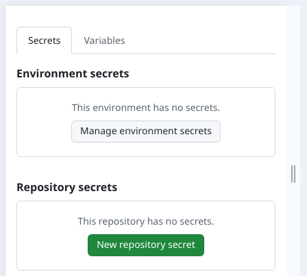
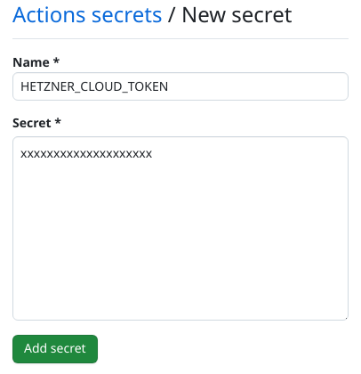

# Terraform

## Index

1. [Install Terraform CLI](#1-install-terraform-cli)  
2. [SSH keys & Hetzner tokens](#2-ssh-keys--hetzner-tokens)  
3. [Environment variables](#3-environment-variables)

---

## 1 Install Terraform CLI

Follow the official guide → <https://developer.hashicorp.com/terraform/tutorials/aws-get-started/install-cli>.  


[←Index](#index)

## 2 SSH keys & Hetzner tokens

Use the assets created in [002 Hetzner login, domain & tokens](./002_hetzner_login_domain_API_tokens.md):

[←Index](#index)

## 3 Environment variables

Terraform reads variables from `.env.development`.

```bash
set -a
source .env.development   # or .env.production
set +a
```
We need to protect the sensible variables of terraform in github secrets.



Terraform need to read this variables with worflow of github actions.
Create worflow in root folder:

.github/workflows/terraform.yml


```
HETZNER_CLOUD_TOKEN=your-cloud-token
HETZNER_DNS_TOKEN=your-dns-token
SSH_PRIVATE_KEY_PATH=./002_ssh_key/ssh_vps_hetzner_deploy_github_action
```

Never commit `.env.*` files; they are listed in `.gitignore`. Export the values before running Terraform:

```bash
export $(grep -v '^#' .env.development | xargs)
terraform init
```

### GitHub Actions

Store the sensitive values in GitHub Secrets to keep CI runs clean:

1. Repository Settings → Secrets and variables → Actions → add `HETZNER_CLOUD_TOKEN` and `HETZNER_DNS_TOKEN`.
2. Reference them in your workflow so Terraform receives the same inputs:

```yaml
env:
  TF_VAR_HETZNER_CLOUD_TOKEN: ${{ secrets.HETZNER_CLOUD_TOKEN }}
  TF_VAR_HETZNER_DNS_TOKEN: ${{ secrets.HETZNER_DNS_TOKEN }}
```

Only the suffix after `TF_VAR_` is case-sensitive and must match the Terraform variable name (`variable "cloud_api_token"`); using lowercase keeps parity with the `.tf` files while allowing the GitHub secret names themselves to stay uppercase.

[←Index](#index)
